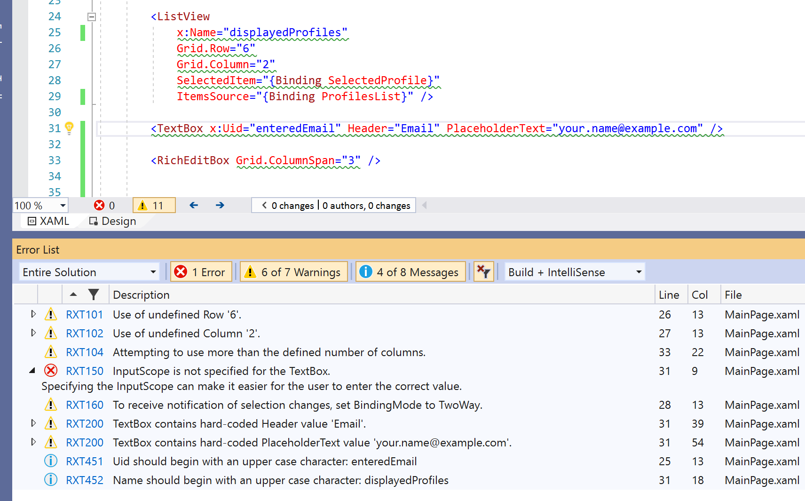
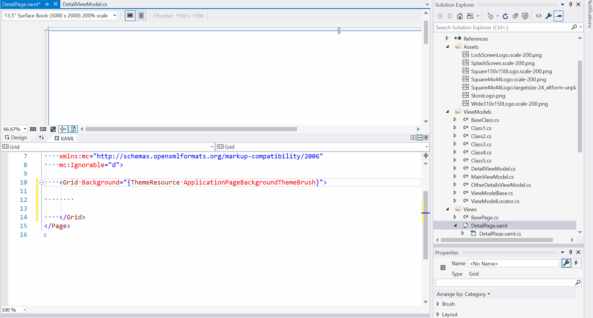

# Rapid XAML Toolkit

This is a collection of tools for making it easier for developers to work with XAML (**UWP**, **WPF**,  **Xamarin.Forms**, **WinUI3**, and **.NET MAUI**). These tools include

- Get in-editor **analysis of your XAML** to find and fix issues faster.
- **Generate** XAML from your ViewModels.
- **Enhance the editor** window.
- **Roslyn Analyzers** (to help with code related to MVVM and XAML)
- **Project & Item Templates** (to create new apps faster)

Get it from the [VS Marketplace](https://marketplace.visualstudio.com/items?itemName=MattLaceyLtd.RapidXamlToolkit)

## XAML Analysis

Like [Roslyn Analyzers](https://docs.microsoft.com/en-us/visualstudio/code-quality/roslyn-analyzers-overview?view=vs-2019) **but for XAML**. Identify potential issues and use the Suggested Actions to make fixes.

You can also create your own [**Custom Analyzers**](./docs/custom-analysis.md) and run the analysis as part of a **Build/CI process** with this [NuGet package](https://www.nuget.org/packages/RapidXaml.BuildAnalysis/).

Learn more about [features](./docs/features.md).

## XAML Generation

Turn your ViewModels into XAML with a couple of clicks or a drag of the mouse.

The generated XAML is based on common conventions but is highly [configurable](./docs/configuration.md).

---

## Principles guiding this project

- Developers using XAML deserve the best tools possible.
- Doing something is better than doing nothing.
- Everything that is output should be configurable.
- C# and VB.NET are supported equally.
- The toolkit won't do things that Visual Studio can already do. (Without very good reason.)
- The toolkit can't generate the final XAML as every app requires unique customization.
- This toolkit is focused specifically on tooling for working with XAML. It will not include controls, etc.

## Installation

Please see the [**getting started guide**](./docs/getting-started.md).

## Contributing

Please see the [contribution guide](./CONTRIBUTING.md).

---

## History

The Rapid XAML Toolkit (RXT) was started as a sister project to [Windows Template Studio (WinTS)](https://aka.ms/wts).  
It was oringinally created in partnership with Microsoft (that's why [github.com/microsoft/rapid-xaml-toolkit redirects](github.com/microsoft/rapid-xaml-toolkit) here) but is now primarily cared for by [Matt Lacey](https://github.com/mrlacey).
