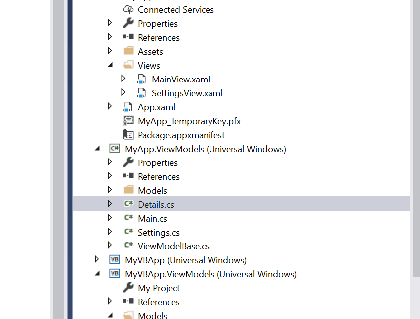
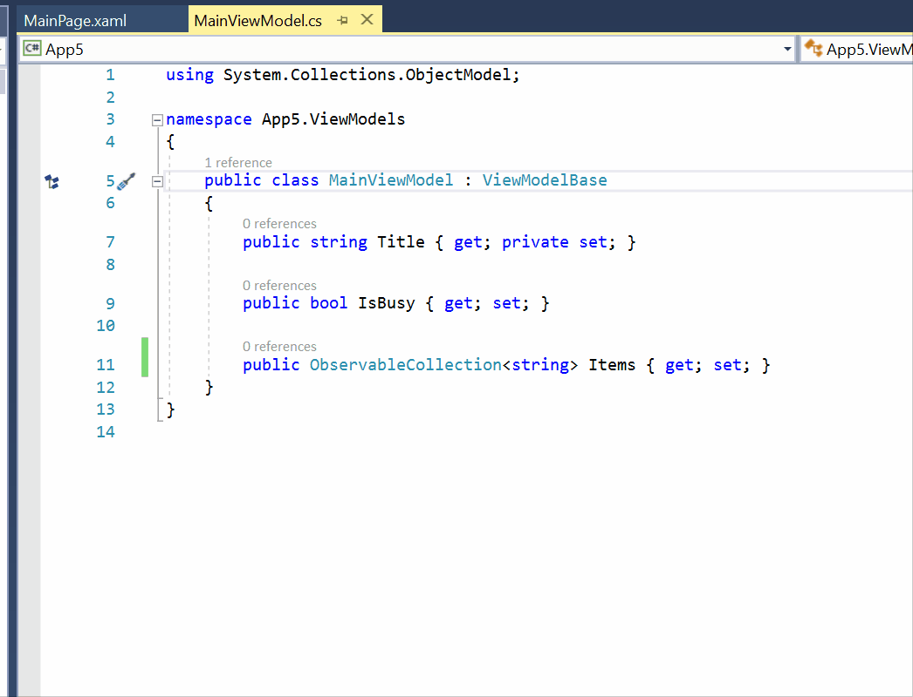

# Rapid XAML Toolkit

Creating a XAML UI can be slow or require lots of manual effort. These tools aim to reduce the time and effort required to get the basics working and allow you to customize the UI to meet your preferences or the specific needs of your app.   
We can't and don't try to create the whole app for you but we can make creating and working with XAML faster easier.
The functionality of the toolkit is based common conventions but is highly [configurable](./docs/profiles.md).

## Overview

The Rapid XAML Toolkit aims to help developers with two aspects of working with XAML files.

- Creating new XAML files
- Modifying existing XAML files

### Creation

In very few apps is the UI created first. It's more common to start with the data Model and the ViewModels and then create the UI for them. Allow the Rapid XAML Toolkit to scaffold your Views based on your ViewModels.

### Modification and improvement

If you already have an empty page, you can easily get the XAML for the ViewModel and paste them into the View.

You don't have to copy the XAML for the whole class.

[[*IMAGE (ANI-GIF) NEEDED - COPY SELECTION TO CLIPBOARD & PASTE*]]

If you want to add the XAML for multiple properties you can send it to the toolbox and use it from there.

[[*IMAGE (ANI-GIF) NEEDED - SEND MULTIPLE PROPERTIES TO THE TOOLBOX*]]

In addition to creating the XAML for the View, you can also set the DataContext. In CodeBehind.

[[*IMAGE (ANI-GIF) NEEDED - SET DATACONTEXT IN CODEBEHIND*]]

Or in the XAML.

[[*IMAGE (ANI-GIF) NEEDED - SET DATACONTEXT IN XAML*]]

More to follow...

## Principles guiding this project

- Doing something is better than nothing.
- We can't produce the final UI as every app may require unique customization.
- Everything that is output should be configurable.
- C# and VB.Net are supported equally.
- This toolkit is focused specifically on tooling for working with XAML. It will not include controls, etc.

## Installation

details to follow.

## Contributing

Please see the [contribution guide](./CONTRIBUTING.md).
