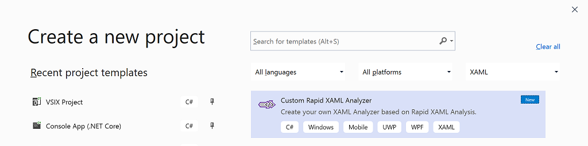
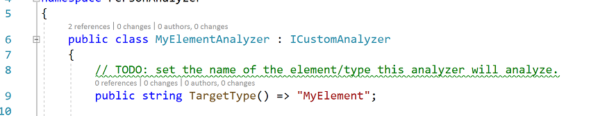
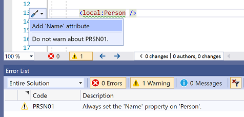

# Custom XAML Analysis

The Rapid XAML Toolkit includes an extensible model for defining your own XAML analyzers. These could be for your own controls or for controls that ship with the platform or a 3rd party.

## Creating your own analyzer

We've tried to make creating your own analyzer as simple as possible.  
There are only a few simple steps.

1. Create a new .NET Standard 2.0 library.
1. Reference the `RapidXamlCustomAnalysis` NuGet pacakge.
1. Create a class that implements `ICustomAnalysis`.
1. Specify the name of the control/element the analyzer relates to.
1. Implement the `Analyze()` method with rules appropriate to your scenario.
1. Reference the library you've created in your application.

The Toolkit includes a 'Rapid XAML Templates' extension which has Project and Item templates that make it even easier.

1. From the **New Project** menu, select 'Custom Rapid XAML Analyzer' and name your project.



2. In the generated analyzer you will first need to specify the name of the Control/Element that the Analyzer will analyze. If you include an XML Namespace Alias your analyzer will only be used for elements that use the exact same xmlns. If you omit the alias, your analyzer will be called regardless of the alias used in the XAML.



3. Next you must implement the logic of the analyzer. This is done in the `Analyze()` method.

The `Analyze()` method is passed an `element` representing the XAML object. By querying this `element` you can check that the XAML is as you want without having to parse the text yourself.  
In addition to `Attributes` and `Children` collection properties, the `element` includes the following helper methods to make your life simpler.

- `ContainsAttribute(attributeName)` - Check to see if the element has an attribute with the specified name.
- `ContainsChild(childName)` - Check to see if the element has a child with the specified name.
- `ContainsDescendant(elementName)` - Check to see if the element has a child or any descendant child with the specified name.
- `GetAttributes(attributeName)` - Get all attributes of the element that have the specified name.
- `GetChildren(childName)` - Get all children that have the specified name.
- `GetDescendants(elementName)` - Get all children, and/or any of their descendants that have the specified name.

All the above methods are case insensitive and allow for the use of any or no xmlns values.

The response from the `Analyze()` method is an `AnalysisActions` object which includes details of what to indicate in the Visual Studio UI as well as what the toolkit should do to address the issue.

Hopefully, the most frequent response your analyzer will give will be that there is nothing to be done. You do this by returning `AnalysisActions.None`.

A fluent interface is provided for defining the `AnalysisActions` and it's flexible enough to handle a wide range of scenarios.

You can indicate a single issue with a simple fix.

```cs
return AnalysisActions.AddAttribute( ... );
```



You can indicate a single issue with a multi-part fix.

```cs
return AnalysisActions.RenameElement( ... )
                      .AndRemoveAttribute( ... )
                      .AndAddAttribute( ... );
```

Note the methods starting `And...` which add multiple parts to the quick action fix without adding extra error entries or suggested actions.


You can indicate multiple issues with simple, or multi-part fixes.

```cs
return AnalysisActions.RemoveAttribute( ... )
                      .AndAddAttribute( ... )
                      .RemoveChild( ... );
```


4. Reference the project containing the analyzer in all projects containing XAML you wish to analyze.  
You can reference the project directly, the compiled DLL, or package the library in a NuGet package and reference it that way.

The generated project also includes example tests to help you verify your analyzers work correctly. They show how you can confirm the analyzer returns the expected response given different XAML strings as input.

## Share your experiences

If you encounter any problems or bugs, please [raise an issue](https://github.com/mrlacey/Rapid-XAML-Toolkit/issues/new/choose).

However, as this functionality is new, it would be great to hear your thoughts on using it. What was easy? What was hard? Was anything confusing or not as you'd expect? Want to be able to do more? [Tell us](https://github.com/mrlacey/Rapid-XAML-Toolkit/issues/new/choose)

If you create an analyzer that you think could be useful to others, you can package it and distribute it as a NuGet package, or consider contributing it back to the toolkit so everyone can use it.
