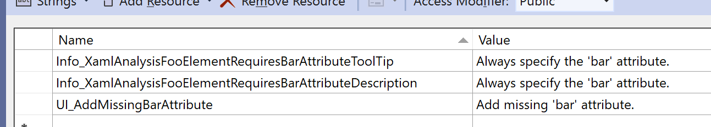
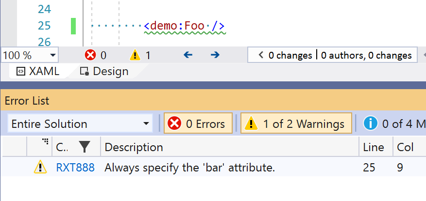
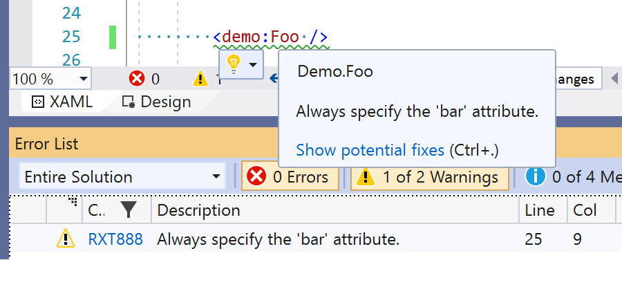
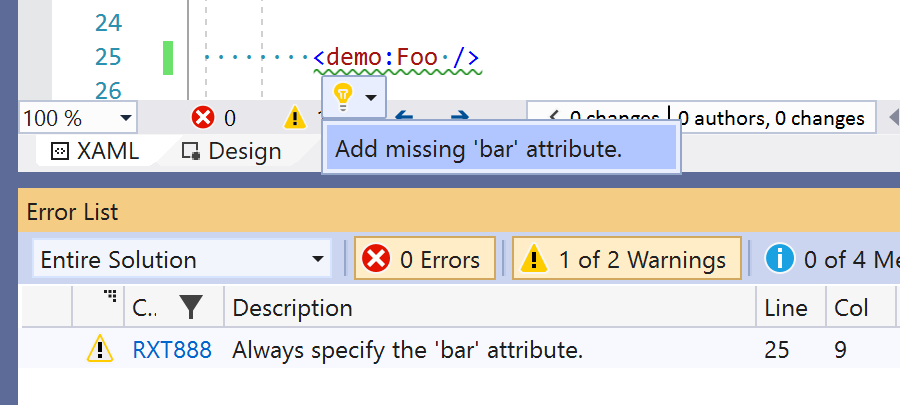
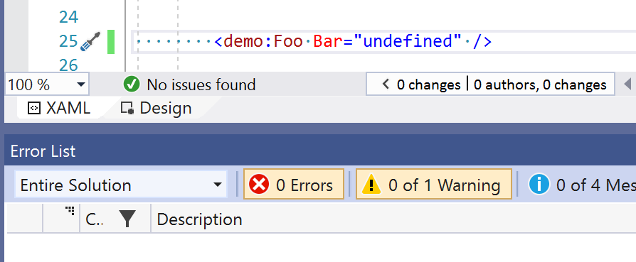

# Extending XAML Analysis

The following is important information for anyone working with this codebase and wishing to add more XAML Analysis functionality.

## Overview

To create a XAML analyzer requires:

- A processor for a UIElement that inherits from `XamlElementProcessor` and is registered in `RapidXamlDocument.GetAllProcessors`. The processor must create Tags for anything of interest and add them to the `tags` collection in the `Process` method.
- A tag that is used to identify the span in the editor that covers the appropriate text. Tags must reference the type of the `SuggestedAction` to execute to address the discovered issue.
- An action that is executed to address the highlighted issue. The action and tag should be registered in `SuggestedActionSource.GetSuggestedActions`.

All tags must inherit from one of either `RapidXamlDiscreteTag`, or `RapidXamlDisplayedTag`.

- **Discrete** : These tags have an underline hint in the UI and no entry in the error list. Example usage: Generate Row/Column Definitions in a Grid.
- **Displayed** : These tags are for actions that have configurable display (Error, Warning, Suggestion, or Hidden) which affects the use of underline and where/if they are shown in the error list.

If the tag introduces a new `ErrorCode`, an accompanying document must also be created.

_Note. Analysis is done by treating the XAML as plain text. This is necessary to be able to create the tags in the correct place in the source, as well as have the line and column reported correctly in the Error List._

## Example

To show how new functionality may be added, let's walk-through adding a new analyzer for a fictional element `foo` that checks that the attribute `bar` is always specified.

```xml
<Foo />   <!-- Not valid -->

<Foo Bar="something" />   <!-- valid -->
```

_Note. This may seem long but every step is currently necessary. Ideally this can be made simpler in the future_

1. Create a class that will handle the processing of the `bar` element. This must inherit from `XamlElementProcessor`. (If you're adding functionality for an element that already has a processor you may be able to skip this step.)

```csharp
public class FooProcessor : XamlElementProcessor
{
    public FooProcessor(ProjectType projectType, ILogger logger)
        : base(projectType, logger)
    {
    }

    public override void Process(
        string fileName,
        int offset,
        string xamlElement,
        string linePadding,
        ITextSnapshot snapshot,
        TagList tags,
        List<TagSuppression> suppressions = null)
    {
        // This will be implemented shortly
    }
}
```

2. Add the required new string resources in `StringRes.resx`



|  Name  |  Value  |
|--------|---------|
| Info_XamlAnalysisFooElementRequiresBarAttributeToolTip | Always specify the 'bar' attribute. |
| Info_XamlAnalysisFooElementRequiresBarAttributeDescription | Always specify the 'bar' attribute.
| UI_AddMissingBarAttribute | Add missing 'bar' attribute. |

The `UI_` prefix is used for text directly displayed in the user interface. The entry specified here will be used in the Suggested Action menu and in the Undo stack.

The `Info_` prefix is used for more general information and may be displayed in various places.

3. Run LocalizationHelper.exe and select option 2.

Learn more about [how this project handles localization](./localization.md).

4. Create the Suggested Action to address the issue. (The interesting bit is in the `Execute` method. All other functionality is very similar in all classes that inherit from `BaseSuggestedAction`)

```csharp
public class FooElementRequiresBarAttributeAction : BaseSuggestedAction
{
    public FooElementRequiresBarAttributeAction(string file)
        : base(file)
    {
        this.DisplayText = StringRes.UI_AddMissingBarAttribute;
    }

    public FooElementRequiresBarAttributeTag Tag { get; private set; }

    public static FooElementRequiresBarAttributeAction Create(FooElementRequiresBarAttributeTag tag, string file)
    {
        var result = new FooElementRequiresBarAttributeAction(file)
        {
            Tag = tag,
        };

        return result;
    }

    public override void Execute(CancellationToken cancellationToken)
    {
        var vs = new VisualStudioTextManipulation(ProjectHelpers.Dte);
        vs.StartSingleUndoOperation(StringRes.UI_AddMissingBarAttribute);
        try
        {
            var lineNumber = this.Tag.Snapshot.GetLineNumberFromPosition(this.Tag.Span.Start) + 1;

            vs.ReplaceInActiveDocOnLine("Foo ", "Foo Bar=\"undefined\" ", lineNumber);

            RapidXamlDocumentCache.TryUpdate(this.File);
        }
        finally
        {
            vs.EndSingleUndoOperation();
        }
    }
}
```

5. Decide the error code to use.

For this sample we'll use `RXT888`. (The value for use in an actual tag will be dependent upon what it does and which platforms to which it applies. Please ask for help with deciding.)

6. Create a new Tag that will be used to draw the squiggly line under the affected code and create the entry in the Error List. (This is as simple as tags get. Note that the defined error code is specific here along with the ErrorType.)

```csharp
public class FooElementRequiresBarAttributeTag : RapidXamlDisplayedTag
{
    public FooElementRequiresBarAttributeTag(Span span, ITextSnapshot snapshot, string fileName)
        : base(span, snapshot, fileName, "RXT888", TagErrorType.Warning)
    {
        this.SuggestedAction = typeof(FooElementRequiresBarAttributeAction);
        this.ToolTip = StringRes.Info_XamlAnalysisFooElementRequiresBarAttributeToolTip;
        this.Description = StringRes.Info_XamlAnalysisFooElementRequiresBarAttributeDescription;
    }
}
```

7. Add a reference for the attribute name in `Attributes.cs`. (This is to limit the number of magic strings in use.)

```csharp
public class Attributes
{
    // ...

    public static string Bar => "Bar";

    // ...
```

8. Add the logic for checking for the required attribute in the `Process` method. (The base class contains a number of helper methods for processing content, including the one we can use here: `TryGetAttribute`.)

```csharp
    public override void Process(
        string fileName,
        int offset,
        string xamlElement,
        string linePadding,
        ITextSnapshot snapshot,
        TagList tags,
        List<TagSuppression> suppressions = null)
    {
        var hasBarAttribute = this.TryGetAttribute(xamlElement, Attributes.Bar, AttributeType.Inline, out _, out _, out _, out _);

        if (!hasBarAttribute)
        {
            tags.TryAdd(
                new FooElementRequiresBarAttributeTag(
                    new Span(offset, xamlElement.Length),
                    snapshot,
                    fileName),
                xamlElement,
                suppressions);
        }
    }
```

9. Add a reference for the element name in `Elements.cs`. (This is to limit the number of magic strings in use.)

```csharp
public class Elements
{
    // ...

    public static string Foo => "Foo";

    // ...
```

10. Register this new processor in `RapidXamlDocument.GetAllProcessors`. (This ensures that the processor is called to process the appropriate elements within a XAML document.)

```csharp
    (Elements.Foo, new FooProcessor(projType, RapidXamlPackage.Logger)),
```

11. Add the suggested action in the switch statement in `SuggestedActionSource.GetSuggestedActions`.

```csharp
    case nameof(FooElementRequiresBarAttributeAction):
        list.AddRange(this.CreateActionSet(
            rxTag.Span,
            FooElementRequiresBarAttributeAction.Create((FooElementRequiresBarAttributeTag)rxTag, this.file)));
        break;
```

12. Run the extension and check everything works as it should.

- Create a XAML page with the issue and check it is reported. (xml namespace aliases are ignored.)



- Move the cursor over the underlined text to see the message.



- Press `ctrl+.` or drop down the list of suggested actions.



- Select the desired action and see that the issue is automatically fixed.



13. Create the document to accompany the error code.

Copy `/docs/warnings/_template.md` and rename it to match the name of the code assigned above. Complete the relevant sections in the document. (See other, similar, files for reference.)

14. Update the master list of all error codes with the new entry.

Add an appropriate entry in `/docs/warnings/readme.md`.

15. Create appropriate tests to accompany the change.

The should be in the `RapidXamlToolkit.Tests` project, in the `XamlAnalysis/Processors` folder. (See other test files for examples of what to test--and how.)

16. Raise a PR with the change.

So everyone can benefit from your contribution.

17. Feel happy knowing you're helping other people find and fix possible issues in their XAML files too.

:)
