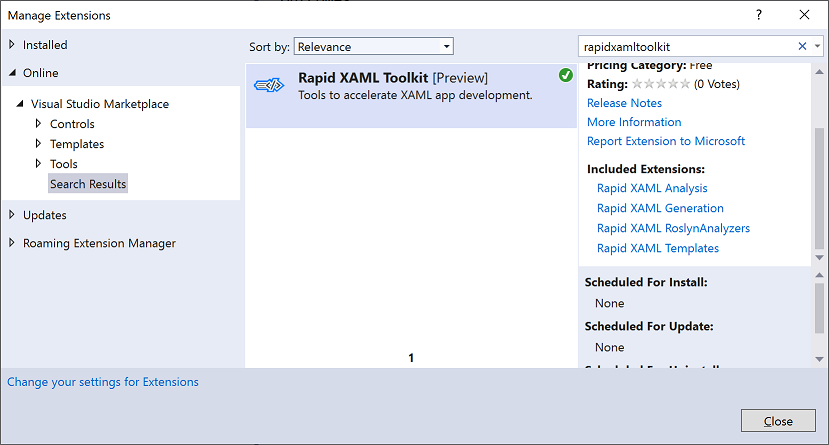
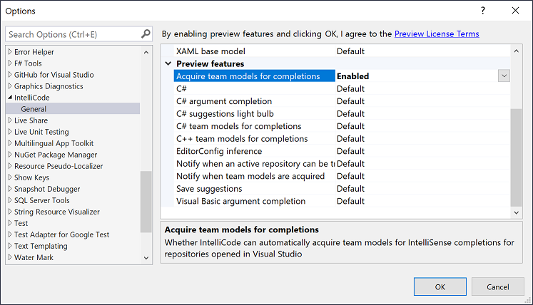

# Getting Started

Whether you want to use the extension or help make it even better--this is the place to start.

## Using the extension

Before you can do anything, you need to install the extension.
While it's being installed you might learn how to configure it to meet your needs. Or try the defaults and then adjust the configuration to your preferred way of working.

### Installing the extension

The latest version is available from the [Visual Studio Marketplace](https://marketplace.visualstudio.com/items?itemName=MattLaceyLtd.RapidXamlToolkit) or by searching inside Visual Studio (Extensions > Manage Extensions).

Please see the [installation guide](installation.md) for more details.

### Configuration

[Control the XAML Generation process](./configuration.md)
[Configure how issues are reported during XAML Analysis](./configuring-analysis.md)

## Working with source

Here's what you need to know if you want to [contribute](../CONTRIBUTING.md) or understand the code-base.

### Solutions

There are three sln file to be aware of

- Templates/RapidXaml.Templates.sln
- VSIX/RapidXamlToolkit.sln
- VSIX/RapidXamlToolkit.PRBuild.sln

####  Templates/RapidXaml.Templates.sln

The `Templates` folder includes `RapidXaml.Templates.sln` which contains the [project and item templates packaged in a VSIX package](https://marketplace.visualstudio.com/items?itemName=MattLaceyLtd.RapidXamlTemplates).
These are kept separate from the other projects to reduce the size of solutions that are worked with.

#### VSIX/RapidXamlToolkit.sln

`RapidXamlToolkit.sln` in the 'VSIX' folder contains the majority of the code in the toolkit including the VSIX and NuGet packages.

The solution contains these projects:

- `BuildAnalysisUwpTestApp` is a UWP app that is used to manually test the BuildAnalysis functionality.
- `RapidXaml.Analysis` is a shipping **VSIX** package that contains the XAML Analysis functionality. _[marketplace link](https://marketplace.visualstudio.com/items?itemName=MattLaceyLtd.RapidXamlAnalysis)_
- `RapidXaml.AnalysisExe` is a console app that is capable of running the XAML Analysis functionality outside of Visual Studio.
- `RapidXaml.BuildAnalysis` is a shipping **NuGet** package that contains RapidXaml.AnalysisExe so that XAML Analysis can be performed as part of a build process. _[install link](https://www.nuget.org/packages/RapidXaml.BuildAnalysis/)_
- `RapidXaml.Common` is a shipping **VSIX** package that contains Visual Studio context menus that are shared by other extensions. _[marketplace link](https://marketplace.visualstudio.com/items?itemName=MattLaceyLtd.RapidXamlCommon)_
- `RapidXaml.CustomAnalysis` is the **NuGet** package that contains the shared logic for custom XAML Analysis. _[install link](https://www.nuget.org/packages/RapidXaml.CustomAnalysis/)_
- `RapidXaml.Generation` is a shipping **VSIX** package that contains the functionality for generating XAML from C# and VB.NET code ._[marketplace link](https://marketplace.visualstudio.com/items?itemName=MattLaceyLtd.RapidXamlGeneration)_
- `RapidXaml.RoslynAnalyzers` is a shipping **VSIX** package that contains Roslyn Analyzers and code fixes. _[marketplace link](https://marketplace.visualstudio.com/items?itemName=MattLaceyLtd.RapidXamlRoslynAnalyzers)_
- `RapidXaml.Shared` is a library containing code shared between other projects that produce a VSIX package.
- `RapidXamlToolkit` is a shipping **VSIX** extension pack for bundling all separate tools through a single extension. _[marketplace link](https://marketplace.visualstudio.com/items?itemName=MattLaceyLtd.RapidXamlToolkit)_
- `RapidXamlToolkit.Tests` is a test project containing automated tests for other projects in the solution.
- `RapidXamlToolkit.Tests.Manual` is a test project containing tests that require additional configuration or manual verification. You will need to make changes to the code to run these tests. Look for comments in the code for details of what to change/specify.
- `Tools/OptionsEmulator` is a WPF app that allows viewing the UI that is displayed in the Options dialogs without having to start an instance of Visual Studio. It is useful in testing .
- `Tools/Benchmarking` is a Console app that contains a sampling of the XAML Analysis functionality and is used for monitoring performance.
- `Tools/RapidXaml.InternalAnalyzers` contains Roslyn code anlayzers for enforcing code patterns and requirements within the solution.
- `Tools/SetVersionNumbers` is a Console app that can set the version number in all files that are part of the toolkit. This exists to avoid manually changing multiple files.

#### VSIX/RapidXamlToolkit.PRBuild.sln

There is another solution (`RapidXamlToolkit.PRBuild.sln`) in the 'VSIX' folder which only contains the main extension projects and the automated tests project. This solution is used by the PR and CI pipelines. Depending on what you do with the source, you _may_ be able to get by with using this solution.

### Warnings and TODO comments

All warnings are treated as errors in the release build.  
'TODO' comments that do not reference an issue number will create warnings and fail CI builds. (Courtesy of [WarnAboutTODOs](https://www.nuget.org/packages/WarnAboutTODOs/))

### Intellicode

An intellicode model for the code-base is automatically maintained and available if you enable automatic acquisition by going to Tools > Options > IntelliCode > Acquire team models for completion.  

### Extending XAML Analysis

The area where contributions are most expected (and appreciated) is in creating more functionality for XAML Analysis. To help with this, there is a [guide to extending XAML Analysis](./extending-xaml-analysis.md) which contributors are encouraged to read.

### Localization

Because of the many components of the codebase and the way they interact, the localization of content is not as straight-forward as in other projects. Specifics are detailed in the [localization document](./localization.md).

### Code signing

Release builds of projects that produce .vsix or .nupkg files are automatically signed. The signing process relies on the following environment variables being set.

- `SIGN_CERT_HASH` is the hash of the certificate.
- `SIGN_CERTIFICATE` is the path to the .pfx file.
- `SIGN_PASSWORD` is the password for the certificate.

