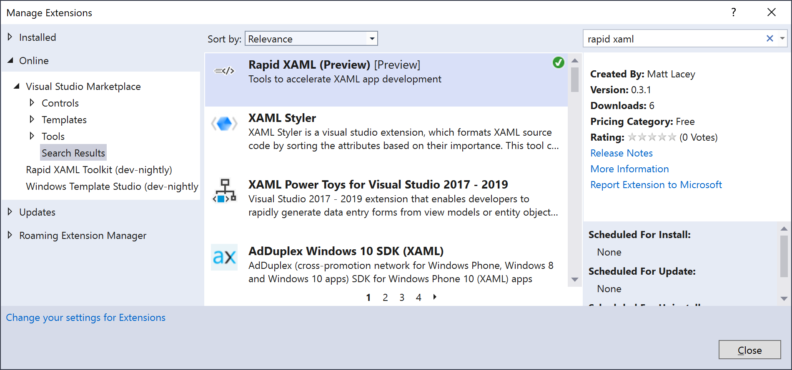
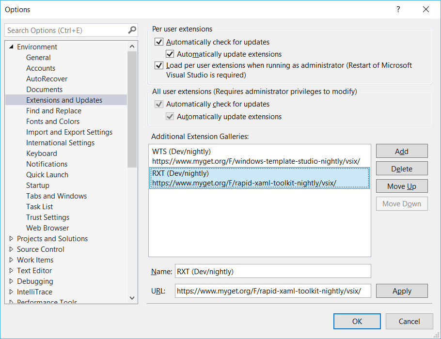
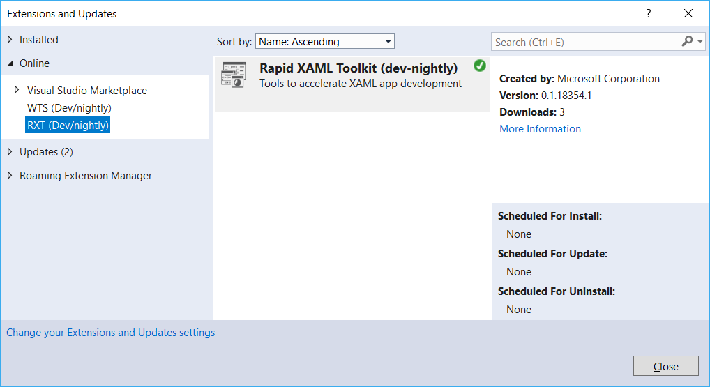

# Installation

There are multiple installation options available if you don't want to build from source.
We do not recommend having more than one version of the extension installed in a version of Visual Studio.

## Preview Release

You can now [get an early preview release from the marketplace](https://marketplace.visualstudio.com/items?itemName=MattLaceyLtd.RapidXamlPreview).

Please note that the [preview release](https://marketplace.visualstudio.com/items?itemName=MattLaceyLtd.RapidXamlPreview) will be removed once the official release is available.

## Official Releases

Details will be added here once available.

## Nightly (dev) builds

A versions of the extension is built every night and made available via MyGet. This provides early access to the latest functionality but may contain bugs or incomplete functionality.

To install this version you must first add an additional extension gallery.

In Visual Studio, go to **Tools→ Extensions & Updates** then click on **Change your Extensions and Updates settings** (bottom left of the 'Extensions and Updates' window) and create an Additional Extension Gallery.

The name can be whatever you want but the URL must be **https://www.myget.org/F/rapid-xaml-toolkit-nightly/vsix/**.

Once the gallery is added, you can search for the extension by going to **Tools→ Extensions & Updates** and using the recently added online gallery (added under the 'Online' node) to download and install the extension. Note that you may need to restart Visual Studio to complete the process.

Once installed you can begin using the extension and should [start by configuring it for the way you work](./configuration.md).
