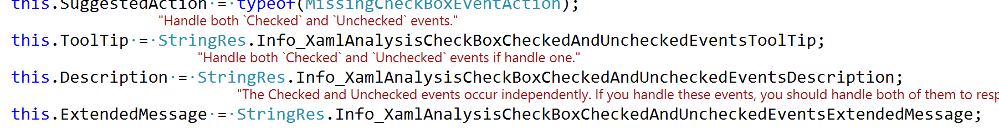

# Localization

The following is essential information to know for anyone working with this codebase. It explains how to add new localized resources.

## Background

When the project was created (with Microsoft), the development included full support for all languages into which translations of Visual Studio are available. When Microsoft withdrew from this project, we also lost their resources for translating and testing those translations. Given this, we are unable to provide translations of the toolkit. However, all text content should be created in a resource file so that, hopefully, we will be able to provide translated versions in the future.

## Extension specific resources

Localized extension-specific strings are in `VSPackage.resx` within each project. You should not need to change this.

The exception to this is in `RapidXaml.Generation\Resources\OptionsStringRes.resx` which contains strings used in the UI of the options dialog for configuring XAML generation.

## General resources

`RapidXaml.Shared\Resources\StringRes.resx` is the only place you are likely to need to add resources.

The shared library contains the string resources used by all extensions, as it is simpler to keep everything together rather than manage multiple resource files.

### Naming conventions

Resource names use the following prefixes:

- **Error_** - used in relation to an error or exception in the toolkit code.
- **Info_** - used for content that is output to the Output Pane or other logs.
- **Prompt_** - indicates display in a dialog.
- **UI_** - indicates display in the UI of Visual Studio.

Do not add other prefixes without discussion.

There is also a special, non-prefixed entry for the project's name.

### Important points to note

- Avoid modifying existing string resources.
- Avoid reusing string resources in multiple locations unless the context is the same.
- Please follow the existing naming conventions.

Make working with embedded string resources easier by installing the [String Resource Visualizer Extension](https://marketplace.visualstudio.com/items?itemName=MattLaceyLtd.StringResourceVisualizer).

